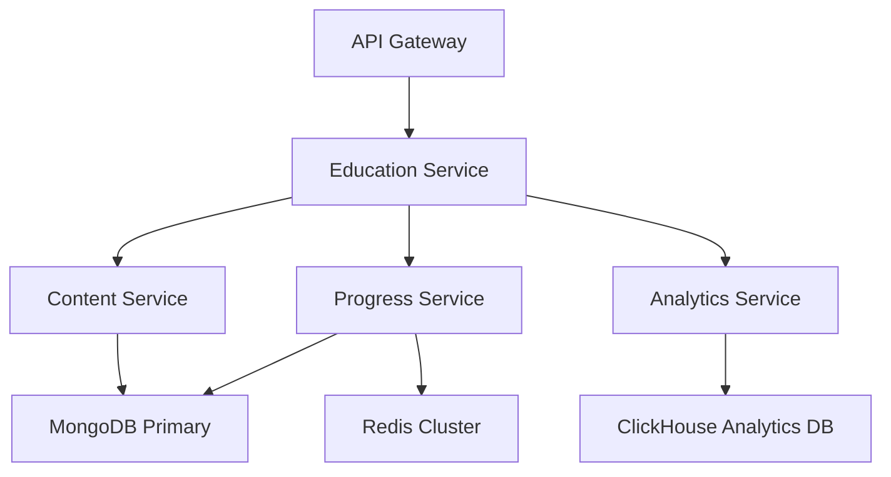

# Education Module API Contract
## TapHealth DTx - Production-Ready Healthcare Education Platform

### Executive Summary
This contract defines the complete API surface for TapHealth's Education Module, designed to serve **millions of requests daily** across mobile and web clients in a distributed healthcare ecosystem. The API powers a personalized diabetes education platform that delivers curated video content, adaptive quizzes, and intelligent progress tracking.

**Platform Capabilities**:
- **Daily Curation Engine**: AI-driven content selection with time-based delivery slots
- **Adaptive Assessment**: Dynamic quiz system with 3/3 pass requirement and remediation paths
- **Progress Intelligence**: Comprehensive analytics for learning outcomes and retention
- **Enterprise Scale**: Built for high availability, horizontal scaling, and multi-tenant architecture

**Production Context**:
- **Peak Load**: 100K+ concurrent users during morning/evening slots
- **Global Distribution**: CDN-optimized video delivery across 15+ regions
- **Compliance**: HIPAA-compliant data handling and audit trails
- **Integration**: Seamless connectivity with TapHealth's coaching, glucose tracking, and nutrition modules

---

## Table of Contents
1. [Architecture Overview](#architecture-overview)
2. [Authentication & Security](#authentication--security)
3. [API Versioning Strategy](#api-versioning-strategy)
4. [Core Data Models](#core-data-models)
5. [Daily Learning APIs](#daily-learning-apis)
6. [Assessment & Progress APIs](#assessment--progress-apis)
7. [Content Discovery APIs](#content-discovery-apis)
8. [Analytics & Insights APIs](#analytics--insights-apis)
9. [Error Handling & Resilience](#error-handling--resilience)
10. [Performance & Scaling](#performance--scaling)
11. [Legacy Compatibility](#legacy-compatibility)

---

## Architecture Overview

### Service Boundaries
```
┌─────────────────┐    ┌─────────────────┐    ┌─────────────────┐
│   Mobile App    │    │    Web Client   │    │  Coach Portal   │
│   (iOS/Android) │    │                 │    │                 │
└─────────┬───────┘    └─────────┬───────┘    └─────────┬───────┘
          │                      │                      │
          └──────────────────────┼──────────────────────┘
                                 │
                    ┌─────────────▼─────────────┐
                    │     API Gateway           │
                    │   (Rate Limiting,         │
                    │    Authentication)        │
                    └─────────────┬─────────────┘
                                 │
                ┌────────────────┼────────────────┐
                │                │                │
      ┌─────────▼─────────┐ ┌────▼────┐ ┌────────▼────────┐
      │  Education API    │ │ Profile │ │   Analytics     │
      │  (Content, Quiz)  │ │ Service │ │   Service       │
      └─────────┬─────────┘ └────┬────┘ └────────┬────────┘
                │                │                │
         ┌──────▼──────┐  ┌──────▼──────┐ ┌──────▼──────┐
         │   MongoDB   │  │   Redis     │ │ ClickHouse  │
         │ (Education  │  │ (Sessions)  │ │ (Analytics) │
         │  Content)   │  │             │ │             │
         └─────────────┘  └─────────────┘ └─────────────┘
```

### Request Flow Patterns
1. **Content Retrieval**: Gateway → Education API → MongoDB (with Redis caching)
2. **Progress Tracking**: Gateway → Education API → MongoDB + Analytics Service
3. **Real-time Updates**: WebSocket connections for progress sync across devices

---

## Authentication & Security

### Authentication Methods
```http
Authorization: Bearer <JWT_TOKEN>
X-Client-Version: 2.1.0
X-Platform: ios|android|web
X-Device-ID: <unique_device_identifier>
```

**Token Requirements**:
- **Expiry**: 24 hours for mobile, 8 hours for web
- **Refresh**: Automatic refresh 5 minutes before expiry
- **Scope**: `education:read`, `education:write`, `analytics:read`

### Security Considerations
- **Rate Limiting**: 1000 requests/hour per user, 10 requests/second burst
- **Data Encryption**: TLS 1.3 in transit, AES-256 at rest
- **PII Handling**: Zero PHI in education content responses
- **Audit Logging**: All quiz submissions and progress updates logged

---

## API Versioning Strategy

### Version Support Matrix
| Version | Status | Support Until | Key Features |
|---------|--------|---------------|--------------|
| **V2** | Current | Ongoing | Time-slot curation, adaptive quizzes, weekly reviews |
| **V1** | Maintenance | Dec 2025 | Basic content delivery, legacy quiz format |
| **Legacy** | Deprecated | Jun 2025 | Original endpoint structure, minimal features |

### Base URLs
- **Production**: `https://api.taphealth.com/dtx/v{version}/education/`
- **Staging**: `https://staging-api.taphealth.com/dtx/v{version}/education/`


---

## Core Data Models

### EducationPlanEntry
**Purpose**: Represents a single learning unit within the user's personalized education journey

```typescript
interface EducationPlanEntry {
  // Identifiers
  id: string;                    // MongoDB ObjectId
  userId: string;                // User identifier
  contentId: number;             // Reference to master content library
  
  // Scheduling & Organization
  date: string;                  // YYYY-MM-DD - when this content is scheduled
  timeSlot: TimeSlot;           // Delivery window: morning | afternoon | evening | bedtime
  
  // Content Data
  title: string;                 // Human-readable lesson title
  description: string;           // Brief lesson summary (2-3 sentences)
  script?: string;              // Video transcript for accessibility
  
  // Media Assets
  video: {
    url: string;                 // HLS streaming URL (CDN-optimized)
    thumbnail: string;           // Optimized preview image (WebP format)
    fullTime: string;           // Total duration in MM:SS format
    playbackTime: string;       // Current user progress in MM:SS format
  };
  
  // Assessment Data
  quiz: QuizQuestion[];          // Array of 3 quiz questions
  
  // Progress Tracking
  completionStatus: boolean;     // true if quiz passed (3/3) and video watched
  progress: {
    watchPercentage: number;     // 0-100, calculated from playbackTime/fullTime
    quizAttempts: number;       // Total quiz attempts for this lesson
    lastQuizScore: number;      // Most recent quiz score (0-3)
    needsReview: boolean;       // true if quiz failed, requires remediation
    lastAccessed: string;       // ISO timestamp of last interaction
  };
  
  // Metadata for Personalization
  metadata: {
    collection: string;          // "Nutrition" | "Basics" | "Lifestyle" | "Advanced"
    difficulty: DifficultyLevel; // easy | moderate | advanced
    videoType: VideoType;       // basics | lifestyle-tip | deep-dive | case-study
    estimatedWatchTime: number; // Minutes to complete lesson
    tags: string[];             // ["diabetes-basics", "meal-planning", etc.]
  };
  
  // Audit Trail
  createdAt: string;            // ISO timestamp
  updatedAt: string;            // ISO timestamp
}
```

### QuizQuestion
**Purpose**: Individual assessment question with answer validation and feedback

```typescript
interface QuizQuestion {
  _id: string;                  // Question identifier
  question: string;             // Question text
  options: string[];            // Array of 3-4 multiple choice options
  correctOption: string;        // Exact text match of correct answer
  explanation?: string;         // Educational feedback for incorrect answers
  difficulty: DifficultyLevel;  // Question complexity level
  topic: string;               // Subject area (e.g., "glucose-monitoring")
}
```

### TimeSlot Definitions
```typescript
enum TimeSlot {
  MORNING = "morning",     // 12:30 AM - 12:00 PM ("Morning Game Plan")
  AFTERNOON = "afternoon", // 12:00 PM - 4:00 PM ("Afternoon Lift") 
  EVENING = "evening",     // 4:00 PM - 8:00 PM ("Evening Essentials")
  BEDTIME = "bedtime"      // 8:00 PM - 12:30 AM ("Bedtime Prep")
}

enum DifficultyLevel {
  EASY = "easy",           // Foundational concepts
  MODERATE = "moderate",   // Intermediate application
  ADVANCED = "advanced"    // Complex scenarios and problem-solving
}

enum VideoType {
  BASICS = "basics",               // Core diabetes education
  LIFESTYLE_TIP = "lifestyle-tip", // Practical daily advice
  DEEP_DIVE = "deep-dive",        // Comprehensive topic exploration
  CASE_STUDY = "case-study"       // Real-world scenario analysis
}
```

### WeeklyReview Data Model
**Purpose**: Aggregated learning assessment for knowledge retention

```typescript
interface WeeklyReview {
  weekPeriod: {
    startDate: string;          // Monday of the review week (YYYY-MM-DD)
    endDate: string;            // Sunday of the review week (YYYY-MM-DD)
    availableFrom: string;      // When review becomes accessible (ISO timestamp)
  };
  
  summary: {
    lessonsCompleted: number;   // Total lessons finished this week
    topicsLearned: string[];    // Unique topics covered
    averageQuizScore: number;   // Mean score across all quizzes (0-3)
    streakDays: number;         // Consecutive days with learning activity
  };
  
  topicSummaries: TopicSummary[]; // Key learnings by subject area
  
  reviewQuiz: {
    totalQuestions: number;     // Adaptive based on week's content
    questions: WeeklyQuizQuestion[]; // Mix of topics covered
    timeLimit?: number;         // Optional time constraint (minutes)
  };
  
  rewards: {
    completionBadge?: string;   // Achievement identifier
    experiencePoints: number;  // Gamification points earned
    unlockableContent?: string[]; // Premium content unlocked
  };
  
  status: "pending" | "in_progress" | "completed" | "expired";
}

interface TopicSummary {
  topic: string;              // Subject area name
  keyLearnings: string[];     // 2-3 bullet points of main concepts
  masteryLevel: number;       // 0-100 calculated from quiz performance
  recommendedNext: string[];  // Suggested follow-up topics
}
```

---

## Daily Learning APIs

### 1. Get Daily Education Plan

#### **Endpoint**: `GET /api/dtx/v2/education`

**Purpose**: Retrieves the user's personalized daily learning plan with time-slot organization. This is the primary entry point for the daily education experience (PRD Step 1).

**Who Uses It**: Mobile apps, web dashboard, coach portal
**When to Use**: App launch, Learn tab navigation, periodic refresh
**What to Expect**: Time-organized content list with current availability status

#### Request Parameters
```http
GET /api/dtx/v2/education?currentDate=2025-07-03&timeSlot=morning&includeCompleted=false
```

| Parameter | Type | Required | Description | Default |
|-----------|------|----------|-------------|---------|
| `currentDate` | string | Yes | Date in YYYY-MM-DD format | - |
| `timeSlot` | string | No | Filter by specific slot: morning\|afternoon\|evening\|bedtime | All slots |
| `includeCompleted` | boolean | No | Include already completed lessons | `true` |
| `refreshCache` | boolean | No | Force regeneration of cached plan | `false` |

#### Response Format
```json
{
  "code": 200,
  "status": "success",
  "message": "Daily plan loaded successfully",
  "data": {
    "planDate": "2025-07-03",
    "currentTimeSlot": "morning",
    "totalLessons": 4,
    "completedToday": 1,
    
    "timeSlots": {
      "morning": {
        "label": "Morning Game Plan",
        "activeWindow": "12:30 AM - 12:00 PM",
        "isCurrentSlot": true,
        "lessons": [
          {
            "id": "67aa587a3e05ebd502122187",
            "title": "Understanding A1C Levels",
            "description": "Learn what A1C means and how it tracks your diabetes management over time.",
            "estimatedTime": 3,
            "difficulty": "easy",
            "collection": "Basics",
            "thumbnail": "https://cdn.taphealth.com/education/thumbnails/a1c-basics.webp",
            "status": "not_started",
            "video": {
              "duration": "02:45",
              "playbackTime": "00:00"
            },
            "quiz": {
              "totalQuestions": 3,
              "attempts": 0
            }
          }
        ]
      },
      "afternoon": {
        "label": "Afternoon Lift", 
        "activeWindow": "12:00 PM - 4:00 PM",
        "isCurrentSlot": false,
        "isUpcoming": true,
        "lessons": [...]
      }
    },
    
    "summary": {
      "streakDays": 4,
      "completionRate": 0.75,
      "needsReview": ["67aa587a3e05ebd502122185"],
      "nextMilestone": {
        "type": "weekly_completion",
        "progress": 6,
        "target": 10
      }
    }
  },
  "meta": {
    "requestId": "req_8f7e6d5c4b3a",
    "responseTime": 245,
    "cacheHit": true,
    "nextRefresh": "2025-07-04T00:30:00Z"
  }
}
```

#### Buffer Period Response (12:00-12:30 AM)
During the daily plan generation window, a special response is returned:

```json
{
  "code": 200,
  "status": "success", 
  "message": "Building today's personalized plan",
  "data": {
    "bufferPeriod": true,
    "estimatedReady": "2025-07-04T00:30:00Z",
    "fallbackContent": {
      "yesterdayAvailable": true,
      "exploreRecommended": ["nutrition-basics", "glucose-monitoring"]
    }
  }
}
```

#### Error Scenarios
| Error Code | Scenario | Response | Client Action |
|------------|----------|-----------|---------------|
| 404 | No plan exists for date | `{"code": 404, "message": "No education plan found for this date"}` | Show empty state, suggest Explore |
| 429 | Rate limit exceeded | `{"code": 429, "retryAfter": 60}` | Implement exponential backoff |
| 503 | Plan generation in progress | `{"code": 503, "message": "Plan being generated, try again in 30s"}` | Retry with delay, show loading state |

---

### 2. Get Video Summary

#### **Endpoint**: `GET /api/dtx/v2/education/{lessonId}/summary`

**Purpose**: Provides lesson preview information before video playback (PRD Step 2). Enables users to make informed decisions about watching vs. skipping to quiz.

**Who Uses It**: Mobile apps when user taps on lesson card  
**When to Use**: Before video playback, when user needs lesson context  
**What to Expect**: Detailed lesson metadata with action options

#### Request Parameters
```http
GET /api/dtx/v2/education/67aa587a3e05ebd502122187/summary
```

#### Response Format
```json
{
  "code": 200,
  "status": "success",
  "message": "Video summary retrieved successfully",
  "data": {
    "id": "67aa587a3e05ebd502122187",
    "title": "Understanding A1C Levels",
    "description": "Learn what A1C means for your diabetes management and how to interpret your test results.",
    "collection": "Basics",
    "difficulty": "easy",
    "estimatedTime": 3,
    
    "learningObjectives": [
      "Understand what A1C measures",
      "Know target A1C ranges for diabetes",
      "Learn how A1C relates to daily glucose readings"
    ],
    
    "video": {
      "duration": "02:45",
      "thumbnail": "https://cdn.taphealth.com/education/thumbnails/a1c-basics.webp",
      "hasTranscript": true
    },
    
    "quiz": {
      "totalQuestions": 3,
      "allowSkipToQuiz": true,
      "averageTime": "1 minute"
    },
    
    "status": {
      "current": "not_started",
      "progress": {
        "watchPercentage": 0,
        "quizAttempts": 0,
        "lastAccessed": null
      }
    },
    
    "actions": {
      "primary": {
        "type": "start_video",
        "label": "Start Learning",
        "enabled": true
      },
      "secondary": {
        "type": "skip_to_quiz", 
        "label": "Skip to Quiz",
        "enabled": true,
        "disclaimer": "Test your existing knowledge"
      }
    }
  }
}
```

#### Resume Video Response
For lessons with existing progress:

```json
{
  "code": 200,
  "status": "success",
  "message": "Video summary retrieved successfully",
  "data": {
    "id": "67aa587a3e05ebd502122187",
    "title": "Understanding A1C Levels",
    "status": {
      "current": "in_progress",
      "progress": {
        "watchPercentage": 65,
        "lastPosition": "01:47",
        "lastAccessed": "2025-07-03T14:22:00Z"
      }
    },
    "actions": {
      "primary": {
        "type": "resume_video",
        "label": "Resume from 1:47",
        "enabled": true
      },
      "secondary": {
        "type": "start_over",
        "label": "Start Over",
        "enabled": true
      }
    }
  }
}
```

---

---

## Assessment & Progress APIs

### 3. Submit Quiz Answers

#### **Endpoint**: `POST /api/dtx/v2/education/quiz/submit`

**Purpose**: Handles quiz submission and determines lesson completion status (PRD Steps 3 & 4). Implements the 3/3 pass requirement and intelligent remediation paths.

**Who Uses It**: Mobile apps, web interface
**When to Use**: After video completion or skip-to-quiz selection
**What to Expect**: Immediate scoring with next-action guidance

#### Request Format
```json
{
  "educationPlanId": "67aa587a3e05ebd502122187",
  "answers": [
    {
      "questionId": "67aa587a3e05ebd50212214e",
      "selectedOption": "Average blood sugar over 3 months",
      "timeSpent": 15
    },
    {
      "questionId": "67aa587a3e05ebd50212214f", 
      "selectedOption": "Pancreas",
      "timeSpent": 8
    },
    {
      "questionId": "67aa587a3e05ebd502122150",
      "selectedOption": "7% or lower",
      "timeSpent": 12
    }
  ],
  "source": "after_video",
  "startTime": "2025-07-03T15:30:00Z",
  "endTime": "2025-07-03T15:31:15Z"
}
```

#### Successful Response (3/3 Correct)
```json
{
  "code": 200,
  "status": "success",
  "message": "Excellent work! Lesson completed successfully",
  "data": {
    "score": 3,
    "totalQuestions": 3,
    "passed": true,
    "completionTime": 75,
    
    "results": [
      {
        "questionId": "67aa587a3e05ebd50212214e",
        "correct": true,
        "explanation": "A1C measures average blood glucose over 2-3 months"
      },
      {
        "questionId": "67aa587a3e05ebd50212214f",
        "correct": true,
        "explanation": "Insulin is produced by beta cells in the pancreas"
      },
      {
        "questionId": "67aa587a3e05ebd502122150",
        "correct": true,
        "explanation": "For most adults with diabetes, A1C target is below 7%"
      }
    ],
    
    "lessonStatus": {
      "current": "completed",
      "updated": "2025-07-03T15:31:15Z",
      "addedToProgress": true
    },
    
    "achievements": {
      "streakUpdated": {
        "current": 5,
        "milestone": "5-day learning streak!"
      },
      "badgeEarned": null,
      "pointsAwarded": 15
    },
    
    "nextActions": {
      "primary": {
        "type": "next_lesson",
        "lessonId": "67aa587a3e05ebd502122188",
        "title": "Reading Your Glucose Meter",
        "available": true
      },
      "secondary": {
        "type": "view_progress",
        "label": "See Your Progress",
        "enabled": true
      }
    },
    
    "dailySummary": {
      "completedToday": 3,
      "remainingToday": 1,
      "dailyGoalProgress": 0.75
    }
  }
}
```

#### Failed Response (Score < 3/3)
```json
{
  "code": 200,
  "status": "success",
  "message": "Almost there! Let's review this topic together",
  "data": {
    "score": 2,
    "totalQuestions": 3, 
    "passed": false,
    "completionTime": 85,
    
    "results": [
      {
        "questionId": "67aa587a3e05ebd50212214e",
        "correct": true,
        "explanation": "Correct! A1C measures average blood glucose over 2-3 months"
      },
      {
        "questionId": "67aa587a3e05ebd50212214f",
        "correct": false,
        "selectedAnswer": "Liver", 
        "correctAnswer": "Pancreas",
        "explanation": "Insulin is actually produced by beta cells in the pancreas, not the liver",
        "conceptArea": "anatomy-basics"
      },
      {
        "questionId": "67aa587a3e05ebd502122150",
        "correct": true,
        "explanation": "Excellent! The target A1C for most adults is below 7%"
      }
    ],
    
    "lessonStatus": {
      "current": "needs_review",
      "updated": "2025-07-03T15:31:15Z",
      "addedToReviewQueue": true
    },
    
    "remediation": {
      "recommendedAction": "rewatch_video",
      "focusAreas": ["anatomy-basics", "insulin-function"],
      "estimatedReviewTime": 2,
      "additionalResources": [
        {
          "type": "related_video",
          "title": "How Your Body Produces Insulin",
          "id": "67aa587a3e05ebd502122155"
        }
      ]
    },
    
    "nextActions": {
      "primary": {
        "type": "rewatch_video",
        "label": "Review the Video",
        "enabled": true,
        "note": "Focus on how insulin is produced"
      },
      "secondary": {
        "type": "try_again_later",
        "label": "Try Again Later", 
        "enabled": true,
        "note": "This will appear in your weekly review"
      }
    },
    
    "retryPolicy": {
      "canRetry": true,
      "unlimited": true,
      "cooldownPeriod": 0
    }
  }
}
```

### 4. Update Video Playback Progress

#### **Endpoint**: `PATCH /api/dtx/v2/education/video/playback`

**Purpose**: Tracks video viewing progress for analytics and resume functionality. Critical for completion validation and engagement metrics.

**Who Uses It**: Video player components
**When to Use**: Every 10 seconds during video playback, on pause/play/seek
**What to Expect**: Lightweight acknowledgment with updated progress

#### Request Format
```json
{
  "lessonId": "67aa587a3e05ebd502122187",
  "playbackTime": "01:23",
  "totalTime": "02:45",
  "watchPercentage": 50.3,
  "sessionId": "sess_8f7e6d5c4b3a",
  "timestamp": "2025-07-03T15:28:33Z",
  "eventType": "progress_update"
}
```

#### Response Format
```json
{
  "code": 200,
  "status": "success",
  "message": "Progress updated",
  "data": {
    "lessonId": "67aa587a3e05ebd502122187",
    "currentProgress": {
      "playbackTime": "01:23",
      "watchPercentage": 50.3,
      "lastUpdated": "2025-07-03T15:28:33Z"
    },
    "milestones": {
      "halfway": true,
      "almostComplete": false
    },
    "autoSaveEnabled": true
  }
}
```

### 5. Get Learning Progress Analytics

#### **Endpoint**: `GET /api/dtx/v2/education/progress`

**Purpose**: Comprehensive learning analytics dashboard data. Powers progress tracking, streak visualization, and performance insights.

**Who Uses It**: Mobile progress screens, web dashboard, coach portal
**When to Use**: Progress tab access, weekly summaries, coach reviews
**What to Expect**: Detailed analytics with actionable insights

#### Request Parameters
```http
GET /api/dtx/v2/education/progress?period=week&includeDetails=true
```

| Parameter | Type | Required | Description | Options |
|-----------|------|----------|-------------|---------|
| `period` | string | No | Analytics timeframe | `day`, `week`, `month`, `all` |
| `includeDetails` | boolean | No | Include lesson-level breakdown | Default: `false` |
| `metric` | string | No | Focus on specific metric | `completion`, `quiz`, `engagement` |

#### Response Format
```json
{
  "code": 200,
  "status": "success",
  "message": "Learning progress retrieved successfully",
  "data": {
    "overview": {
      "totalLessonsCompleted": 47,
      "currentStreak": 8,
      "longestStreak": 12,
      "averageQuizScore": 2.7,
      "totalWatchTime": 142,
      "completionRate": 0.85
    },
    
    "streakData": {
      "current": 8,
      "longest": 12,
      "dailyActivity": [
        { "date": "2025-06-27", "lessonsCompleted": 2, "active": true },
        { "date": "2025-06-28", "lessonsCompleted": 3, "active": true },
        { "date": "2025-06-29", "lessonsCompleted": 1, "active": true }
        // ... last 30 days
      ]
    },
    
    "weeklyProgress": {
      "currentWeek": {
        "startDate": "2025-06-30",
        "endDate": "2025-07-06", 
        "lessonsCompleted": 14,
        "goal": 15,
        "progressPercent": 93
      },
      "topicsLearned": ["nutrition", "glucose-monitoring", "medication-management"],
      "averageSessionTime": 8.5,
      "quizPerformance": {
        "averageScore": 2.8,
        "improvementRate": 0.15,
        "difficultAreas": ["carb-counting", "insulin-timing"]
      }
    },
    
    "achievements": {
      "recentBadges": [
        {
          "id": "nutrition_master", 
          "name": "Nutrition Master",
          "earnedDate": "2025-07-02",
          "description": "Completed all basic nutrition lessons"
        }
      ],
      "nextMilestone": {
        "type": "streak_milestone",
        "target": 10,
        "current": 8,
        "daysRemaining": 2
      }
    },
    
    "needsAttention": {
      "reviewQueue": [
        {
          "lessonId": "67aa587a3e05ebd502122185",
          "title": "Carb Counting Basics",
          "failedDate": "2025-07-01",
          "attempts": 2,
          "lastScore": 1
        }
      ],
      "recommendations": [
        {
          "type": "review_topic",
          "title": "Review Carbohydrate Counting",
          "reason": "Multiple quiz failures",
          "priority": "high"
        }
      ]
    }
  }
}
```

---

## Content Discovery APIs

### 6. Explore Education Library

#### **Endpoint**: `GET /api/dtx/v2/education/explore`

**Purpose**: Browse the complete education library with filtering and search capabilities (PRD Step 5). Enables user-driven content discovery beyond daily plans.

**Who Uses It**: Mobile explore tab, web library, search functionality
**When to Use**: User wants to browse beyond daily plan, search for specific topics
**What to Expect**: Organized content library with smart filtering

#### Request Parameters
```http
GET /api/dtx/v2/education/explore?collection=nutrition&difficulty=easy&status=not_started&search=carb
```

| Parameter | Type | Required | Description | Options |
|-----------|------|----------|-------------|---------|
| `collection` | string | No | Filter by content category | `nutrition`, `basics`, `lifestyle`, `advanced` |
| `difficulty` | string | No | Filter by complexity level | `easy`, `moderate`, `advanced` |
| `status` | string | No | Filter by completion status | `not_started`, `in_progress`, `completed`, `needs_review` |
| `search` | string | No | Text search in titles/descriptions | Any string |
| `limit` | number | No | Results per page | Default: 20, Max: 100 |
| `offset` | number | No | Pagination offset | Default: 0 |

#### Response Format
```json
{
  "code": 200,
  "status": "success",
  "message": "Library content retrieved successfully",
  "data": {
    "totalResults": 127,
    "filters": {
      "applied": {
        "collection": "nutrition",
        "difficulty": "easy"
      },
      "available": {
        "collections": [
          { "name": "nutrition", "count": 34, "label": "Nutrition & Diet" },
          { "name": "basics", "count": 28, "label": "Diabetes Basics" },
          { "name": "lifestyle", "count": 41, "label": "Lifestyle Management" },
          { "name": "advanced", "count": 24, "label": "Advanced Topics" }
        ],
        "difficulties": [
          { "level": "easy", "count": 67 },
          { "level": "moderate", "count": 43 },
          { "level": "advanced", "count": 17 }
        ]
      }
    },
    
    "collections": [
      {
        "name": "nutrition",
        "displayName": "Nutrition & Diet",
        "description": "Learn about food choices, meal planning, and carbohydrate counting",
        "totalLessons": 34,
        "completedLessons": 12,
        "estimatedTime": 95,
        "difficulty": "easy",
        "thumbnail": "https://cdn.taphealth.com/collections/nutrition.webp",
        "featured": true,
        
        "lessons": [
          {
            "id": "67aa587a3e05ebd502122190",
            "title": "Carb Counting Made Simple",
            "description": "Master the basics of counting carbohydrates in your meals",
            "duration": "03:15",
            "difficulty": "easy",
            "status": "not_started",
            "thumbnail": "https://cdn.taphealth.com/education/thumbnails/carb-counting.webp",
            "tags": ["carbohydrates", "meal-planning", "basics"],
            "estimatedTime": 5,
            "quiz": {
              "totalQuestions": 3,
              "averageScore": 2.4,
              "passRate": 0.78
            }
          }
        ]
      }
    ],
    
    "recommendations": {
      "personalized": [
        {
          "lessonId": "67aa587a3e05ebd502122195",
          "reason": "Based on your recent quiz performance",
          "confidence": 0.87
        }
      ],
      "trending": [
        {
          "lessonId": "67aa587a3e05ebd502122198",
          "reason": "Most watched this week",
          "viewCount": 1247
        }
      ]
    },
    
    "pagination": {
      "current": 1,
      "total": 7,
      "hasNext": true,
      "hasPrevious": false,
      "nextOffset": 20
    }
  }
}
```
          }
        ]
      }
    ],
    
    "recommendations": {
      "personalized": [
        {
          "lessonId": "67aa587a3e05ebd502122195",
          "reason": "Based on your recent quiz performance",
          "confidence": 0.87
        }
      ],
      "trending": [
        {
          "lessonId": "67aa587a3e05ebd502122198",
          "reason": "Most watched this week",
          "viewCount": 1247
        }
      ]
    },
    
    "pagination": {
      "current": 1,
      "total": 7,
      "hasNext": true,
      "hasPrevious": false,
      "nextOffset": 20
    }
  }
}
```

### 7. Weekly Review Management

#### **Endpoint**: `GET /api/dtx/v2/education/weekly-review`

**Purpose**: Generate personalized weekly learning review and assessment. Reinforces knowledge retention and identifies learning gaps.

**Who Uses It**: Mobile apps for weekly summaries, coach portal for progress monitoring
**When to Use**: Sunday evening/Monday morning, triggered notifications
**What to Expect**: Comprehensive review with adaptive quiz

#### Request Parameters
```http
GET /api/dtx/v2/education/weekly-review?week=2025-W27&includeQuiz=true
```

#### Response Format
```json
{
  "code": 200,
  "status": "success",
  "message": "Weekly review generated successfully",
  "data": {
    "reviewPeriod": {
      "week": "2025-W27",
      "startDate": "2025-06-30",
      "endDate": "2025-07-06",
      "availableUntil": "2025-07-13T23:59:59Z"
    },
    
    "summary": {
      "lessonsCompleted": 14,
      "activeDays": 6,
      "totalWatchTime": 38,
      "averageQuizScore": 2.6,
      "topicsLearned": ["nutrition", "glucose-monitoring", "medication-management"],
      "streak": {
        "maintained": true,
        "currentLength": 8
      }
    },
    
    "topicSummaries": [
      {
        "topic": "Nutrition & Meal Planning",
        "lessonsCompleted": 6,
        "keyLearnings": [
          "Carbohydrate counting affects blood glucose levels",
          "Portion control helps manage post-meal spikes",
          "Fiber slows glucose absorption"
        ],
        "masteryLevel": 85,
        "recommendedNext": ["advanced-carb-counting", "restaurant-eating"]
      }
    ],
    
    "reviewQuiz": {
      "totalQuestions": 8,
      "estimatedTime": 4, // minutes
      "adaptiveQuestions": true,
      "questions": [
        {
          "_id": "review_q1_2025w27",
          "question": "Based on this week's lessons, what's the main benefit of counting carbohydrates?",
          "options": [
            "Weight loss",
            "Better blood glucose control", 
            "Increased energy",
            "Improved sleep"
          ],
          "topic": "nutrition",
          "difficulty": "moderate",
          "sourceLesson": "67aa587a3e05ebd502122190"
        }
      ]
    },
    
    "rewards": {
      "available": {
        "completionBadge": "weekly_learner_july",
        "experiencePoints": 50,
        "unlockableContent": ["advanced_nutrition_tips"]
      },
      "requirements": {
        "quizPassScore": 6, // out of 8
        "timeLimit": null
      }
    },
    
    "status": "pending"
  }
}
```

#### Submit Weekly Review
```http
POST /api/dtx/v2/education/weekly-review/submit
```

**Request Format**:
```json
{
  "reviewId": "review_2025w27_67aa587a",
  "answers": [
    {
      "questionId": "review_q1_2025w27",
      "selectedOption": "Better blood glucose control",
      "timeSpent": 12
    }
  ],
  "startTime": "2025-07-07T19:30:00Z",
  "endTime": "2025-07-07T19:34:15Z"
}
```

**Response Format**:
```json
{
  "code": 200,
  "status": "success",
  "message": "Weekly review submitted successfully",
  "data": {
    "score": 7,
    "totalQuestions": 8,
    "passed": true,
    "rewards": {
      "badgeEarned": "weekly_learner_july",
      "experiencePoints": 50
    },
    "nextWeekPreview": {
      "availableDate": "2025-07-14",
      "estimatedLessons": 12
    }
  }
}
```

---

## Analytics & Insights APIs

### 8. Learning Analytics Dashboard

#### **Endpoint**: `GET /api/dtx/v2/education/analytics`

**Purpose**: Advanced analytics for coaches and internal teams. Provides population-level insights and individual performance trends.

**Who Uses It**: Coach portal, internal analytics dashboards, research team
**When to Use**: Coaching sessions, performance reviews, product optimization
**What to Expect**: Detailed metrics with trend analysis and comparative benchmarks

#### Request Parameters
```http
GET /api/dtx/v2/education/analytics?userId=67aa587a&timeframe=30d&metrics=engagement,outcomes
```

#### Response Format
```json
{
  "code": 200,
  "status": "success", 
  "message": "Analytics data retrieved successfully",
  "data": {
    "userMetrics": {
      "engagementTrends": {
        "dailyMinutes": [8, 12, 0, 15, 9, 11, 7],
        "completionRate": 0.82,
        "dropoffPoints": ["01:30", "02:15"],
        "optimalLearningTime": "09:00"
      },
      
      "learningOutcomes": {
        "knowledgeRetention": 0.78,
        "skillProgression": {
          "carb-counting": 0.65,
          "glucose-monitoring": 0.88,
          "medication-timing": 0.71
        },
        "behaviorChange": {
          "glucoseCheckingImprovement": 0.23,
          "mealLoggingIncrease": 0.31
        }
      }
    },
    
    "comparativeBenchmarks": {
      "peerGroup": "type2_newly_diagnosed",
      "userRanking": {
        "completionRate": 78,
        "quizPerformance": 85,
        "consistency": 92
      }
    },
    
    "recommendations": {
      "contentOptimization": [
        {
          "type": "increase_difficulty",
          "area": "glucose-monitoring",
          "confidence": 0.91,
          "reason": "Strong performance, ready for advanced concepts"
        }
      ],
      "engagementBoosts": [
        {
          "type": "time_slot_adjustment",
          "suggestion": "Move evening content to morning",
          "expectedImprovement": 0.15
        }
      ]
    }
  }
}
```

---

## Error Handling & Resilience

### Standard Error Response Format
All errors follow a consistent structure for reliable client-side handling:

```json
{
  "code": 400,
  "status": "error",
  "message": "Human-readable error description",
  "error": {
    "type": "validation_error",
    "details": [
      {
        "field": "currentDate",
        "message": "Date must be in YYYY-MM-DD format",
        "code": "INVALID_DATE_FORMAT"
      }
    ],
    "requestId": "req_8f7e6d5c4b3a",
    "timestamp": "2025-07-03T15:30:00Z",
    "retryable": false
  }
}
```

### HTTP Status Code Guidelines

| Code | Usage | Retry Strategy | Client Action |
|------|-------|----------------|---------------|
| **200** | Success | N/A | Process response data |
| **400** | Invalid request data | No retry | Fix request parameters |
| **401** | Authentication failure | No retry | Redirect to login |
| **403** | Insufficient permissions | No retry | Request access upgrade |
| **404** | Resource not found | No retry | Show not found state |
| **429** | Rate limit exceeded | Exponential backoff | Wait and retry |
| **500** | Internal server error | Linear backoff | Show error state, retry |
| **503** | Service unavailable | Exponential backoff | Show maintenance mode |

### Resilience Patterns

#### Circuit Breaker Implementation
- **Threshold**: 5 failures in 60 seconds
- **Recovery**: Attempt every 30 seconds
- **Fallback**: Cached data or graceful degradation

#### Retry Policy
```typescript
interface RetryConfig {
  maxAttempts: 3;
  baseDelay: 1000; // ms
  maxDelay: 30000; // ms
  backoffMultiplier: 2;
  retryableErrors: [429, 500, 502, 503, 504];
}
```

#### Graceful Degradation
- **Video playback**: Fall back to audio-only or transcript
- **Quiz submission**: Cache locally, sync when available
- **Progress tracking**: Optimistic updates with eventual consistency

### Error Scenarios & Handling

#### Network Connectivity Issues
```json
{
  "code": 0,
  "status": "network_error",
  "message": "Unable to connect to education service",
  "error": {
    "type": "connectivity_error",
    "offline": true,
    "cachedDataAvailable": true,
    "retryable": true
  }
}
```

**Client Strategy**: Show cached content, queue updates for sync

#### Rate Limiting Response
```json
{
  "code": 429,
  "status": "error",
  "message": "Too many requests. Please try again later.",
  "error": {
    "type": "rate_limit_exceeded",
    "retryAfter": 60,
    "dailyQuotaRemaining": 850,
    "retryable": true
  }
}
```

**Client Strategy**: Implement exponential backoff, show rate limit UI

#### Content Generation Failure
```json
{
  "code": 503,
  "status": "error",
  "message": "Education plan is being generated. Please try again shortly.",
  "error": {
    "type": "generation_in_progress",
    "estimatedCompletionTime": "2025-07-04T00:30:00Z",
    "fallbackAvailable": true,
    "retryable": true
  }
}
```

**Client Strategy**: Show generation progress, offer yesterday's content

---

## Performance & Scaling

### Performance Targets

| Metric | Target | Monitoring |
|--------|--------|------------|
| **API Response Time** | P95 < 300ms | CloudWatch, DataDog |
| **Video Load Time** | < 2 seconds | CDN metrics |
| **Quiz Submission** | < 100ms | Database query time |
| **Cache Hit Rate** | > 85% | Redis metrics |
| **Availability** | 99.9% | Uptime monitoring |

### Caching Strategy

#### Redis Cache Layers
```typescript
interface CacheConfig {
  dailyPlan: {
    ttl: 86400; // 24 hours
    key: "education:plan:{userId}:{date}";
    warmupTime: "00:30"; // Pre-generate at 12:30 AM
  };
  
  videoMetadata: {
    ttl: 604800; // 7 days
    key: "education:video:{lessonId}";
    invalidateOn: ["content_update"];
  };
  
  userProgress: {
    ttl: 3600; // 1 hour
    key: "education:progress:{userId}";
    writeThrough: true;
  };
}
```

#### CDN Configuration
- **Video Assets**: CloudFront with global edge locations
- **Static Images**: WebP format with lazy loading
- **API Responses**: Edge caching for non-personalized data

### Database Optimization

#### MongoDB Indexing Strategy
```javascript
// Education Plan indexes
db.educationPlans.createIndex({ userId: 1, date: 1 });
db.educationPlans.createIndex({ userId: 1, completionStatus: 1 });
db.educationPlans.createIndex({ date: 1, "metadata.timeSlot": 1 });

// Quiz Performance indexes  
db.quizResults.createIndex({ userId: 1, createdAt: -1 });
db.quizResults.createIndex({ lessonId: 1, passed: 1 });
```

#### Read Replica Strategy
- **Read Operations**: Route to nearest replica
- **Write Operations**: Primary cluster only
- **Analytics Queries**: Dedicated analytics replica

### Horizontal Scaling

#### Load Balancing
- **Algorithm**: Least connections with health checks
- **Auto-scaling**: Based on CPU (70%) and memory (80%) thresholds
- **Geographic**: Route to nearest data center

#### Service Dependencies


---

## Legacy Compatibility

### Migration Strategy

#### V1 to V2 Transition
- **Dual Operation**: Both versions run in parallel
- **Feature Parity**: V1 endpoints maintained until deprecation
- **Data Compatibility**: Shared database with schema versioning
- **Client Migration**: Gradual rollout with feature flags

#### Deprecated Endpoints (V1)

##### Generate Education Plan (Deprecated)
```http
POST /api/dtx/education/generate
```
**Status**: Removed as of V2.0.0
**Migration Path**: Use cron-generated daily plans via `GET /api/dtx/v2/education`
**Final Support**: June 30, 2025

##### Legacy Progress Update
```http
PATCH /api/dtx/education/video/status?id={lessonId}
```
**Status**: Deprecated, use V2 playback endpoint
**Migration Path**: `PATCH /api/dtx/v2/education/video/playback`
**Support Until**: December 31, 2025

### Backward Compatibility Matrix

| Feature | V1 Support | V2 Enhancement | Migration Required |
|---------|------------|----------------|-------------------|
| Basic video retrieval | ✅ Full | Enhanced metadata | Optional |
| Quiz submission | ✅ Full | Detailed feedback | Recommended |
| Progress tracking | ⚠️ Limited | Real-time analytics | Required |
| Time-slot curation | ❌ None | Core feature | Required |
| Weekly reviews | ❌ None | New feature | N/A |

### Data Schema Evolution

#### V1 Schema Support
```typescript
// Legacy EducationPlan structure (maintained)
interface LegacyEducationPlan {
  userId: string;
  date: string;
  title: string;
  description: string;
  video: {
    url: string;
    thumbnail: string;
    fullTime: string;
    playbackTime: string;
  };
  quiz: LegacyQuizQuestion[];
  completionStatus: boolean;
}
```

#### V2 Schema Extensions
```typescript
// Enhanced structure with backward compatibility
interface EducationPlanV2 extends LegacyEducationPlan {
  metadata: TimeSlotMetadata;
  progress: DetailedProgress;
  analytics: EngagementMetrics;
}
```

---

## Conclusion

This API contract represents a production-ready foundation for TapHealth's Education Module, designed to serve millions of users while maintaining the flexibility to evolve with changing healthcare education needs. The architecture emphasizes reliability, scalability, and developer experience, ensuring both current functionality and future extensibility.

### Key Implementation Priorities
1. **Reliability First**: Circuit breakers, retries, and graceful degradation
2. **Performance Optimization**: Intelligent caching and CDN utilization  
3. **User Experience**: Consistent response formats and clear error handling
4. **Analytics Integration**: Comprehensive tracking for continuous improvement
5. **Compliance**: HIPAA-ready data handling and audit capabilities

### Next Steps
- **Phase 1**: Core daily plan and quiz APIs (V2.0) - *Target: Q3 2025*
- **Phase 2**: Weekly review and advanced analytics (V2.1) - *Target: Q4 2025*
- **Phase 3**: AI-powered personalization and adaptive difficulty (V2.2) - *Target: Q1 2026*

### Implementation Readiness Checklist
- [ ] Backend API endpoints implemented
- [ ] Database schema migration scripts ready
- [ ] Authentication & authorization integration
- [ ] Rate limiting and caching configured
- [ ] Error monitoring and alerting setup
- [ ] Mobile/web client integration testing
- [ ] Performance benchmarking completed
- [ ] Security audit passed
- [ ] Documentation and deployment guides finalized

### Technical Dependencies
- **Database**: MongoDB 6.0+ with proper indexing
- **Cache**: Redis Cluster 7.0+ for session management
- **CDN**: CloudFront for video delivery
- **Analytics**: ClickHouse for learning analytics
- **Monitoring**: DataDog/CloudWatch for performance tracking

For implementation questions or clarifications, contact the Platform Engineering team or refer to the detailed technical specifications in the engineering documentation.
