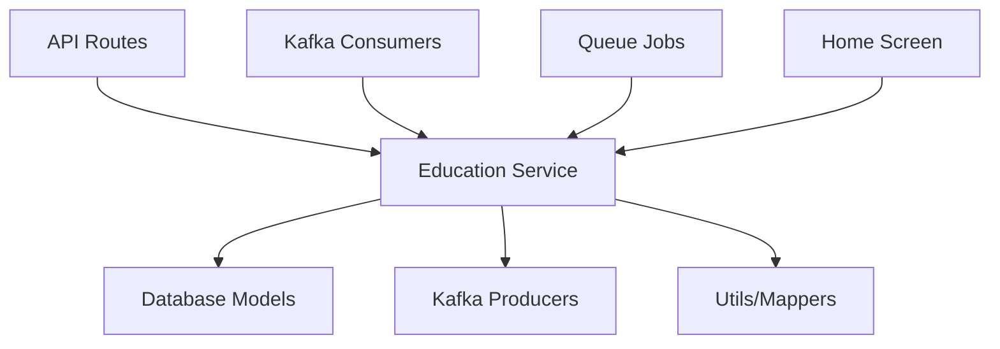

# Education Module - Comprehensive README

## 📚 Module Overview

The Education Module is a comprehensive learning system that provides **personalized diabetes education** through curated video content, interactive quizzes, and progress tracking. It bridges the gap between data and decision-making by delivering structured, contextual learning experiences.

### 🎯 Core Purpose
- **Educate users** about diabetes management through short, digestible videos
- **Build confidence** in health decision-making
- **Track learning progress** and mastery
- **Provide personalized content** based on user profile (age, diabetes type, BMI, gender)
- **Create daily learning habits** through curated plans

## 🏗️ Module Architecture

### 📁 **File Structure & Dependencies**

```
src/
├── services/
│   ├── education.ts                    # 🔥 Core business logic (current file)
│   ├── v1/education.ts                # V1 API wrapper service
│   └── v2/education.ts                # V2 API wrapper service
├── models/
│   ├── education-plan.ts              # User's assigned education plans
│   └── education-content.ts           # Available educational content library
├── routes/
│   ├── v1/education/
│   │   ├── index.ts                   # Route definitions
│   │   ├── get-education-plan.ts      # Fetch user plans
│   │   ├── create-education-plan.ts   # Generate new plans
│   │   ├── update-playback.ts         # Video progress tracking
│   │   └── update-completion-status.ts # Mark lessons complete
│   └── v2/education/
│       ├── index.ts
│       ├── get-education-plan.ts
│       └── create-education-plan.ts
├── events/
│   ├── consumers/education-generate.ts # Kafka consumer for plan generation
│   └── producers/
│       ├── education-created.ts       # Kafka producer for new plans
│       └── activity-logged.ts         # Activity tracking producer
├── queues/
│   └── generate.ts                    # Background job processing (line 136+)
├── utils/
│   └── education.ts                   # Helper functions & mappers
├── constants/
│   └── education.ts                   # Module constants
└── __tests__/
    └── education-plan.test.ts         # Test suite
```

### 🔗 **Dependency Flow**



## 🚀 Current Implementation Status

### ✅ **What's Working**

1. **Core Education Service** ([`education.ts`](src/services/education.ts))
   - ✅ Plan generation based on user profile
   - ✅ Content retrieval with date ranges
   - ✅ Video playback time tracking
   - ✅ Completion status management
   - ✅ Kafka event publishing

2. **Database Models**
   - ✅ [`EducationPlan`](src/models/education-plan.ts) - User assigned plans
   - ✅ [`EducationContent`](src/models/education-content.ts) - Content library

3. **API Routes**
   - ✅ V1 & V2 REST endpoints
   - ✅ CRUD operations for education plans
   - ✅ Video progress tracking
   - ✅ Authentication middleware

4. **Background Processing**
   - ✅ Kafka consumers for plan generation
   - ✅ Queue-based processing
   - ✅ Activity logging events

5. **Integration Points**
   - ✅ Home screen integration
   - ✅ Profile-based personalization
   - ✅ Redis caching support

### ❌ **What's Missing (Based on Requirements)**

1. **Daily Plan Engine** 🚨
   - ❌ Time-based content curation (Morning/Afternoon/Evening/Bedtime)
   - ❌ 12:30 AM daily plan generation
   - ❌ Buffer period handling (12:00-12:30 AM)
   - ❌ Progressive disclosure by time slots

2. **Quiz System** 🚨
   - ❌ 3-question MCQ per lesson
   - ❌ Quiz result handling (3/3 required to complete)
   - ❌ "Skip to Quiz" functionality
   - ❌ Review queue for failed quizzes

3. **Video Summary Screen** 🚨
   - ❌ Pre-watch lesson summary
   - ❌ Difficulty level badges
   - ❌ "What You'll Learn" descriptions
   - ❌ Resume from timestamp functionality

4. **Explore Module** 🚨
   - ❌ Collection-based browsing (Nutrition, Basics, etc.)
   - ❌ Video categorization by type
   - ❌ "Needs Review" section
   - ❌ Smart filtering options

5. **Advanced Features** 🚨
   - ❌ Streak tracking
   - ❌ Gamification elements
   - ❌ Personalized coach messages
   - ❌ Weekly summary reports

## 📊 **Current API Endpoints**

### V1 Endpoints
```typescript
GET    /api/dtx/v1/education/plan           # Get education plans
POST   /api/dtx/v1/education/plan           # Create education plan
PUT    /api/dtx/v1/education/playback       # Update video playback
PUT    /api/dtx/v1/education/completion     # Mark lesson complete
```

### V2 Endpoints
```typescript
GET    /api/dtx/v2/education/plan           # Enhanced plan retrieval
POST   /api/dtx/v2/education/plan           # Enhanced plan creation
```

## 🔧 **Current Service Methods**

### Core Methods (✅ Implemented)
```typescript
class EducationService {
  // Plan Management
  async createEducationPlan(params: { profile: ProfileUpdatedData })
  async checkEducationPlanExists(userId: string, date: string): Promise<boolean>
  async getEducationPlan(userId: string, startDate: string, endDate: string): Promise<EducationPlanAttrs[]>
  
  // Video Tracking
  async updatePlaybackTime(id: string, playbackTime: string): Promise<string>
  async updateCompletionStatus(id: string): Promise<void>
  
  // Workflow Handlers
  async handleEducationPlanGeneration(userId: string, todaysDate: string)
  async handleEducationPlanRetrieval(params: { userId: string; currentDate: string; dateShift: number })
  async handleEducationPlanRetrievalInternal(params: { userId: string; startDate: string; endDate: string })
  async handlePlaybackUpdate(params: { id: string; playbackTime: string })
  async handleCompletionStatusUpdate(params: { id: string })
  
  // Private Helpers
  private async generateEducationPlan(userProfile: UserEducationProfile): Promise<EducationContentAttrs[]>
}
```

### Missing Methods (❌ Need Implementation)
```typescript
// Daily Plan Engine
async generateDailyPlan(userId: string, date: string): Promise<DailyPlan>
async getTimeBasedContent(timeSlot: 'morning' | 'afternoon' | 'evening' | 'bedtime'): Promise<Content[]>
async handleBufferPeriod(): Promise<BufferMessage>

// Quiz System
async getQuizForLesson(lessonId: string): Promise<Quiz>
async submitQuizAnswer(quizId: string, answers: Answer[]): Promise<QuizResult>
async addToReviewQueue(lessonId: string, userId: string): Promise<void>
async getReviewQueue(userId: string): Promise<Lesson[]>

// Video Summary
async getLessonSummary(lessonId: string): Promise<LessonSummary>
async getVideoMetadata(videoId: string): Promise<VideoMetadata>

// Explore & Collections
async getCollections(): Promise<Collection[]>
async getCollectionContent(collectionId: string): Promise<Content[]>
async searchContent(query: string, filters: Filter[]): Promise<Content[]>

// Progress & Streaks
async getUserStreak(userId: string): Promise<StreakData>
async updateLearningStreak(userId: string): Promise<void>
async getWeeklySummary(userId: string): Promise<WeeklySummary>
```

## 🗄️ **Database Schema Status**

### ✅ **Existing Models**

#### EducationPlan
```typescript
{
  userId: string,
  date: string,
  title: string,
  description: string,
  completionStatus: boolean,
  video: {
    playbackTime: string,
    videoId: string,
    duration: number
  }
}
```

#### EducationContent
```typescript
{
  title: string,
  description: string,
  typeOfDiabetes: string[],
  minAge: number,
  maxAge: number,
  gender: string[],
  bmiGroups: string[],
  videoId: string,
  duration: number
}
```

### ❌ **Missing Schema Extensions**

```typescript
// Enhanced EducationPlan
{
  // ... existing fields
  timeSlot: 'morning' | 'afternoon' | 'evening' | 'bedtime',
  difficulty: 'easy' | 'moderate' | 'advanced',
  collection: string,
  quizId?: string,
  quizScore?: number,
  quizAttempts?: number,
  needsReview: boolean,
  lastWatched?: Date,
  progressPercentage: number
}

// New Quiz Model
{
  lessonId: string,
  questions: [{
    question: string,
    options: string[],
    correctAnswer: number,
    explanation?: string
  }],
  passingScore: number
}

// New Collection Model
{
  name: string,
  description: string,
  category: 'nutrition' | 'basics' | 'lifestyle' | 'long-term-care',
  contentIds: string[],
  difficulty: string,
  estimatedDuration: number
}

// User Learning Profile
{
  userId: string,
  currentStreak: number,
  longestStreak: number,
  totalLessonsCompleted: number,
  preferredTimeSlots: string[],
  learningPace: 'slow' | 'medium' | 'fast',
  completedCollections: string[],
  reviewQueue: string[]
}
```

## 🔄 **Current vs Required User Flow**

### ✅ **Current Flow**
1. User profile triggers plan generation
2. Education plans created for date range
3. User can view and track video progress
4. Completion status updated
5. Activity logged via Kafka

### ❌ **Required Flow (Missing)**
1. **Daily Plan Loaded** - Time-based content curation
2. **Video Summary** - Pre-watch lesson preview
3. **Quiz System** - 3-question validation
4. **Result Processing** - Pass/fail with review queue
5. **Explore Library** - Collection-based browsing

## 🚨 **Critical Issues & Broken Features**

### 1. **No Quiz System** 
- **Issue**: Videos can be marked complete without knowledge validation
- **Impact**: No learning verification, poor educational outcomes
- **Priority**: HIGH

### 2. **Missing Time-Based Curation**
- **Issue**: All content shown at once, no daily structure
- **Impact**: Overwhelming user experience, poor habit formation
- **Priority**: HIGH

### 3. **No Progressive Learning Path**
- **Issue**: Content not organized by difficulty or sequence
- **Impact**: Users may watch advanced content too early
- **Priority**: MEDIUM

### 4. **Limited Content Discovery**
- **Issue**: No explore/browse functionality
- **Impact**: Reduced engagement, missed learning opportunities
- **Priority**: MEDIUM

### 5. **No Review System**
- **Issue**: Failed understanding not tracked or addressed
- **Impact**: Knowledge gaps persist
- **Priority**: HIGH

## 🛠️ **Refactoring Recommendations**

### 1. **Immediate Fixes (Week 1)**
```typescript
// Add quiz validation to completion
async updateCompletionStatus(id: string, quizScore?: number): Promise<void> {
  if (quizScore && quizScore < 3) {
    // Add to review queue instead of marking complete
    await this.addToReviewQueue(id, userId);
    return;
  }
  // ... existing completion logic
}

// Add time-based content filtering
async getEducationPlan(userId: string, timeSlot?: string): Promise<EducationPlanAttrs[]> {
  const query = {
    userId,
    ...(timeSlot && { timeSlot })
  };
  // ... rest of logic
}
```

### 2. **Medium-term Enhancements (Week 2-3)**
- Implement quiz system with proper validation
- Add collection-based content organization
- Create review queue functionality
- Enhance content metadata with difficulty levels

### 3. **Long-term Features (Week 4+)**
- Implement streak tracking and gamification
- Add AI-powered content recommendations
- Create adaptive learning paths
- Build comprehensive analytics dashboard

## 📈 **Success Metrics (Current vs Target)**

| Metric | Current Status | Target | Gap |
|--------|---------------|--------|-----|
| Daily lesson completion | ❌ Not tracked | 40% of users | Missing analytics |
| Quiz pass rate | ❌ No quizzes | 60-70% | Need quiz system |
| Video watch duration | ✅ Tracked | 80% completion | Available |
| Review queue usage | ❌ Not implemented | 50% revisit rate | Missing feature |
| Streak maintenance | ❌ Not tracked | 30% (3+ days) | Missing gamification |

## 🚀 **Getting Started for Development**

### 1. **Quick Start - Add a Quiz Feature**
```typescript
// src/services/education.ts
async submitQuiz(lessonId: string, answers: number[]): Promise<QuizResult> {
  const quiz = await Quiz.findOne({ lessonId });
  let correctCount = 0;
  
  answers.forEach((answer, index) => {
    if (answer === quiz.questions[index].correctAnswer) {
      correctCount++;
    }
  });
  
  const passed = correctCount >= 3;
  
  if (!passed) {
    await this.addToReviewQueue(lessonId, userId);
  }
  
  return {
    score: correctCount,
    passed,
    feedback: quiz.questions.map(q => q.explanation)
  };
}
```

### 2. **Easy Enhancement - Time-Based Content**
```typescript
// Add to existing generateEducationPlan method
const timeSlot = this.getTimeSlot(); // morning/afternoon/evening/bedtime
const query = {
  $and: [
    // ... existing filters
    { recommendedTimeSlot: { $in: [timeSlot, "any"] } }
  ]
};
```

### 3. **Test Your Changes**
```bash
npm run test                    # Run existing tests
npm run test:ci                # CI environment tests
npm run dev                     # Start development server
```

## 🎯 **Recommended Next Steps**

### **Phase 1: Core Quiz System (High Priority)**
1. Create Quiz model and schema
2. Implement quiz submission logic
3. Add review queue functionality
4. Update completion validation

### **Phase 2: Daily Plan Engine (High Priority)**
1. Implement time-based content curation
2. Add buffer period handling
3. Create progressive disclosure logic
4. Build daily plan generation job

### **Phase 3: Enhanced UX (Medium Priority)**
1. Video summary screens
2. Collection-based browsing
3. Advanced filtering
4. Progress visualization

### **Phase 4: Gamification (Low Priority)**
1. Streak tracking
2. Achievement badges
3. Social features
4. Personalized coaching

## 📞 **Need Help?**

- **Current working features**: Video tracking, plan generation, basic CRUD
- **Start here**: [`src/services/education.ts`](src/services/education.ts) - Main business logic
- **Quick wins**: Add quiz validation, implement time-based filtering
- **Testing**: Use existing test patterns in [`__tests__/education-plan.test.ts`](src/routes/__tests__/education-plan.test.ts)

The education module has a solid foundation but needs significant enhancements to meet the full requirements. Focus on the quiz system and daily plan engine first, as these are critical for the
