# TapHealth DTx - Education Plan User Flow & MongoDB Data Flow Analysis

## 📊 Complete User Flow Analysis

### 1. **System Architecture Overview**

```
┌─────────────────────────────────────────────────────────────────────────────┐
│                           TapHealth DTx Education Platform                  │
├─────────────────────────────────────────────────────────────────────────────┤
│  Frontend App  →  API Gateway  →  Backend Services  →  MongoDB  →  Redis     │
└─────────────────────────────────────────────────────────────────────────────┘
```

### 2. **MongoDB Collections Structure**

```
📊 MongoDB Database: "dtx"
├── 📁 profiles (User profile data)
├── 📁 educationcontents (V2 Education content library)
├── 📁 educationplans (V1 Legacy single-video daily plans)
├── 📁 dailyeducationplanv2s (V2 Multi-video slot-based daily plans)
├── 📁 dailyplans (Overall daily plan including education tasks)
└── 📁 [other collections: workouts, meals, etc.]
```

### 3. **Complete User Journey Flow**

## 🚀 Daily Education Plan Generation (Backend Automated)

### **Step 1: Cron-Triggered Plan Generation (12:30 AM IST)**

```mermaid
graph TD
    A[⏰ Cron Job 12:30 AM IST] --> B[📋 BullMQ Queue]
    B --> C[🔍 Get Active Users]
    C --> D[👥 Process in Batches]
    D --> E[🧠 Generate Plans Per User]
    E --> F[💾 Save to MongoDB]
    
    F --> G[(📊 dailyeducationplanv2s)]
    F --> H[📝 Log Results]
```



**MongoDB Operations:**
- **READ:** `profiles` collection → Get user preferences, diabetes type, age, gender
- **READ:** `educationcontents` → Filter available videos by user criteria
- **READ:** `dailyeducationplanv2s` → Check for existing plans & carry-forward lessons
- **WRITE:** `dailyeducationplanv2s` → Save new daily plan with time slots

### **Step 2: Plan Generation Logic**

```typescript
// MongoDB Query Flow for Plan Generation
1. profiles.findOne({ userId }) → Get user profile
2. educationcontents.find({ 
   typeOfDiabetes: profile.diabetesType,
   gender: profile.gender,
   minAge: { $lte: profile.age },
   maxAge: { $gte: profile.age }
}) → Get eligible content

3. dailyeducationplanv2s.findOne({ 
   userId, 
   date: previousDate 
}) → Check for carry-forward lessons

4. Apply business logic:
   - Max 2 videos per time slot
   - Max 5-6 videos per day
   - Distribute across 4 time slots
   - Carry forward incomplete lessons

5. dailyeducationplanv2s.create(newPlan) → Save generated plan
```

## 📱 User-Facing API Flow

### **Step 3: User Fetches Daily Plan**

```mermaid
graph TD
    A[📱 Frontend Request] --> B{🕐 Buffer Period?}
    B -->|Yes 12:00-12:30 AM| C[⏳ Return 503: Building your plan...]
    B -->|No| D[🔍 Check Existing Plan]
    
    D --> E{📋 Plan Exists?}
    E -->|Yes| F[📊 Return Plan Data]
    E -->|No| G[🧠 Generate On-Demand]
    G --> H[💾 Save & Return]
    
    F --> I[📱 Frontend Displays]
    H --> I
```



**API Endpoints:**
```
GET /api/dtx/v2/education?currentDate=2025-01-08
GET /api/dtx/v2/education?currentDate=2025-01-08&timeSlot=morning
```

**MongoDB Operations:**
- **READ:** `dailyeducationplanv2s.findOne({ userId, date })` → Get existing plan
- **READ:** If not found → Trigger generation logic (Step 2)

### **Step 4: User Interacts with Videos**

```mermaid
graph TD
    A[📱 User Clicks Video] --> B[📺 Video Player Opens]
    B --> C[⏯️ User Watches/Pauses]
    C --> D[📊 Track Progress]
    D --> E[💾 Update MongoDB]
    
    E --> F[(📊 dailyeducationplanv2s)]
    F --> G[🔄 Update lesson status]
    G --> H[📈 Update summary stats]
```



**Progress Tracking APIs:**
```
PATCH /api/dtx/v2/education/video/playback
PATCH /api/dtx/v2/education/video/status
POST /api/dtx/v2/education/quiz/submit
```

**MongoDB Operations:**
- **UPDATE:** `dailyeducationplanv2s` → Update lesson status, playback time
- **UPDATE:** Summary stats → completedLessons, remainingLessons, streakDays

### **Step 5: Quiz Completion & Status Updates**

```mermaid
graph TD
    A[🧠 User Completes Quiz] --> B[📊 Calculate Score]
    B --> C{✅ Pass Score ≥ 3/3?}
    C -->|Yes| D[✅ Mark Completed]
    C -->|No| E[🔄 Mark Needs Review]
    
    D --> F[💾 Update MongoDB]
    E --> G[🔄 Carry Forward Next Day]
    F --> H[📈 Update Streak]
    G --> I[💾 Save Carry-Forward]
```



## 🗄️ Detailed MongoDB Data Flow

### **Collection: `educationcontents`**
```typescript
// Structure
{
  _id: ObjectId,
  contentId: number,
  title: string,
  description: string,
  videoLink: string,
  thumbnail: string,
  videoTime: string,
  timeSlot: "morning" | "afternoon" | "evening" | "bedtime",
  difficulty: "easy" | "moderate" | "advanced",
  contentCollection: "basics" | "nutrition" | "lifestyle" | "advanced",
  typeOfDiabetes: ["Type 1", "Type 2"],
  minAge: number,
  maxAge: number,
  gender: ["male", "female"],
  estimatedTime: number,
  quiz: [{ question, options, correctOption }]
}

// Usage: Content library for plan generation
// READ during: Plan generation (12:30 AM cron + on-demand)
// WRITE during: Admin content management, seeding
```

### **Collection: `dailyeducationplanv2s`**
```typescript
// Structure
{
  _id: ObjectId,
  userId: string,
  date: "2025-01-08", // YYYY-MM-DD
  planGenerated: boolean,
  generatedAt: Date,
  timeSlots: {
    morning: {
      label: "Morning Game Plan",
      activeWindow: "12:30 AM - 12:00 PM",
      isCurrentSlot: boolean,
      isUpcoming: boolean,
      isAvailable: boolean,
      lessons: [
        {
          lessonId: string,
          title: string,
          description: string,
          estimatedTime: number,
          difficulty: "easy" | "moderate" | "advanced",
          collection: "basics" | "nutrition" | "lifestyle",
          timeSlot: "morning",
          status: "new" | "in_progress" | "completed" | "needs_review",
          metadata: {
            collection: string,
            difficulty: string,
            videoType: string,
            tags: string[],
            carryForward: boolean
          },
          video: {
            url: string,
            thumbnail: string,
            duration: string,
            playbackTime: string
          },
          quiz: {
            totalQuestions: number,
            passingScore: number,
            currentScore: number,
            attempts: number,
            questions: [...]
          }
        }
      ]
    },
    afternoon: { ... },
    evening: { ... },
    bedtime: { ... }
  },
  summary: {
    totalLessons: number,
    completedLessons: number,
    remainingLessons: number,
    estimatedTimeRemaining: number,
    streakDays: number,
    carryForwardCount: number
  },
  carryForwardFrom: {
    date: string,
    lessonIds: string[]
  }
}

// Usage: Main daily plan storage
// READ during: User API requests, plan retrieval
// WRITE during: Plan generation, progress updates
// UPDATE during: Video progress, quiz completion, status changes
```

### **Collection: `profiles`**
```typescript
// Structure (relevant fields)
{
  _id: ObjectId,
  userId: string,
  age: number,
  gender: "male" | "female",
  medical: {
    diabetesType: "Type 1" | "Type 2",
    medicalConditions: string[],
    medications: string[]
  },
  preferences: {
    education: string[], // Days of week
    coachType: "FUN" | "PROFESSIONAL",
    programPace: "SLOW" | "MODERATE" | "FAST"
  }
}

// Usage: User personalization for content filtering
// READ during: Plan generation to filter appropriate content
// WRITE during: User onboarding, profile updates
```

## 🔄 Data Flow Patterns

### **1. Plan Generation Flow**
```
Cron (12:30 AM) → BullMQ Queue → Service Layer → MongoDB
                                      ↓
profiles ← educationcontents ← dailyeducationplanv2s
   ↓              ↓                      ↓
User Data → Content Library → Generated Plans
```

### **2. User Request Flow**
```
Frontend → API Routes → Service Layer → MongoDB → Response
    ↓         ↓            ↓            ↓         ↑
Request → Validation → Business Logic → Query → JSON
```

### **3. Progress Update Flow**
```
User Action → Frontend → API → Service → MongoDB Update
    ↓           ↓        ↓      ↓           ↓
Watch Video → Track → PATCH → Logic → Update Status
```

## 📊 Key Business Logic

### **Slot Distribution Algorithm**
```typescript
1. Get carry-forward lessons from previous day
2. Distribute carry-forward lessons across available slots (max 2 per slot)
3. Fill remaining slots with new content:
   - morning: basics/lifestyle content
   - afternoon: nutrition/deep-dive content  
   - evening: lifestyle/case-study content
   - bedtime: relaxation/recap content
4. Ensure daily limits: 5-6 total videos max
5. Filter by user profile: age, gender, diabetes type
6. Sort by: difficulty progression, user preferences
```

### **Carry-Forward Logic**
```typescript
// Previous day's incomplete/needs-review lessons
incompleteStatus = ["in_progress", "needs_review"]
carryForwardLessons = previousPlan.timeSlots[slot].lessons
  .filter(lesson => incompleteStatus.includes(lesson.status))

// Distribute across available slots with limits
distributeCarryForward(carryForwardLessons, newPlan.timeSlots, maxPerSlot=2)
```

## 🚀 Performance & Scaling

### **Database Indexes**
```typescript
// dailyeducationplanv2s
{ userId: 1, date: 1 } // unique index for user daily plans
{ userId: 1, planGenerated: 1 } // for batch processing queries

// educationcontents  
{ timeSlot: 1, difficulty: 1 } // for content filtering
{ typeOfDiabetes: 1, gender: 1, minAge: 1, maxAge: 1 } // user filtering

// profiles
{ userId: 1 } // unique user lookup
```

### **Caching Strategy**
```typescript
// Redis caching (if implemented)
- User profiles: cache for 1 hour
- Education content: cache for 24 hours  
- Daily plans: cache for current day only
- Buffer period status: cache for 30 minutes
```

## 🔧 API Contract Summary

### **Main Endpoints**
| Method | Endpoint | Purpose | MongoDB Operations |
|--------|----------|---------|-------------------|
| `GET` | `/api/dtx/v2/education` | Get daily plan | READ: `dailyeducationplanv2s` |
| `GET` | `/api/dtx/v2/education/:id/summary` | Get lesson details | READ: `dailyeducationplanv2s` |
| `PATCH` | `/api/dtx/v2/education/video/playback` | Update progress | UPDATE: lesson.video.playbackTime |
| `PATCH` | `/api/dtx/v2/education/video/status` | Update completion | UPDATE: lesson.status |
| `POST` | `/api/dtx/v2/education/quiz/submit` | Submit quiz | UPDATE: lesson.quiz, status |
| `POST` | `/api/dtx/v2/education/admin/batch/generate` | Trigger generation | WRITE: batch plans |

### **Response Structure**
```typescript
// Standard API Response
{
  code: 200,
  status: "success",
  message: "Daily education plan retrieved successfully",
  data: {
    date: "2025-01-08",
    planGenerated: true,
    bufferPeriod: false,
    timeSlots: { ... },
    summary: { ... },
    carryForwardFrom?: { ... }
  }
}
```

## 🎯 Key Requirements Implementation

✅ **Multi-video slots**: Max 2 videos per slot (morning/afternoon/evening/bedtime)  
✅ **Daily limits**: 5-6 videos total per day  
✅ **Carry-forward**: Incomplete lessons move to next day  
✅ **Cron timing**: 12:30 AM IST daily generation  
✅ **Buffer period**: 12:00-12:30 AM returns "Building your plan..."  
✅ **User personalization**: Filter by age, gender, diabetes type, preferences  
✅ **Progress tracking**: Video playback, quiz scores, completion status  
✅ **Batch processing**: All users processed in batches of 5  

## 📈 Future Enhancements

- **Advanced Analytics**: Learning patterns, recommendation engine
- **Adaptive Difficulty**: Dynamic content difficulty based on performance  
- **Social Features**: Group challenges, peer progress sharing
- **Offline Support**: Download videos for offline viewing
- **ML Personalization**: AI-driven content recommendations
- **Integration**: Sync with wearables, health apps

---

**Last Updated**: January 8, 2025  
**Version**: V2 Multi-slot Implementation  
**Status**: ✅ Production Ready
